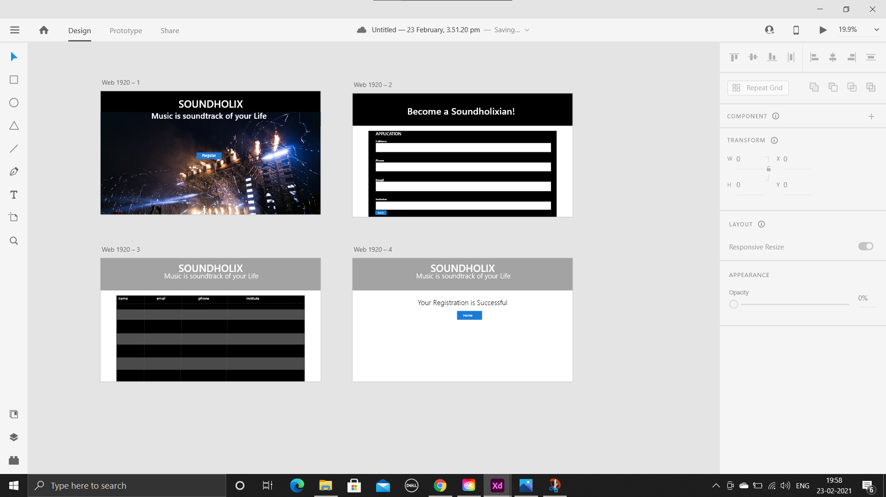
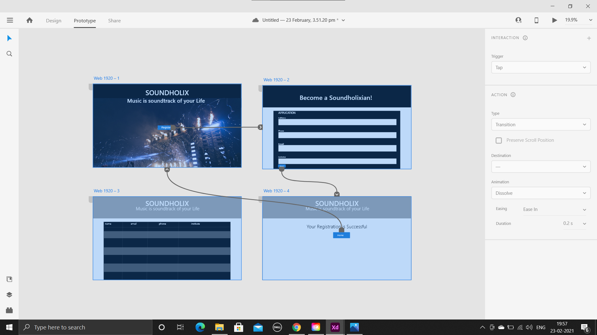
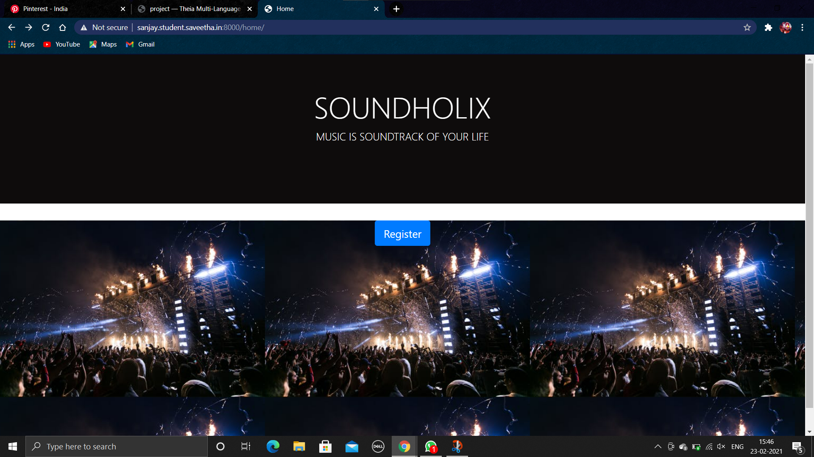
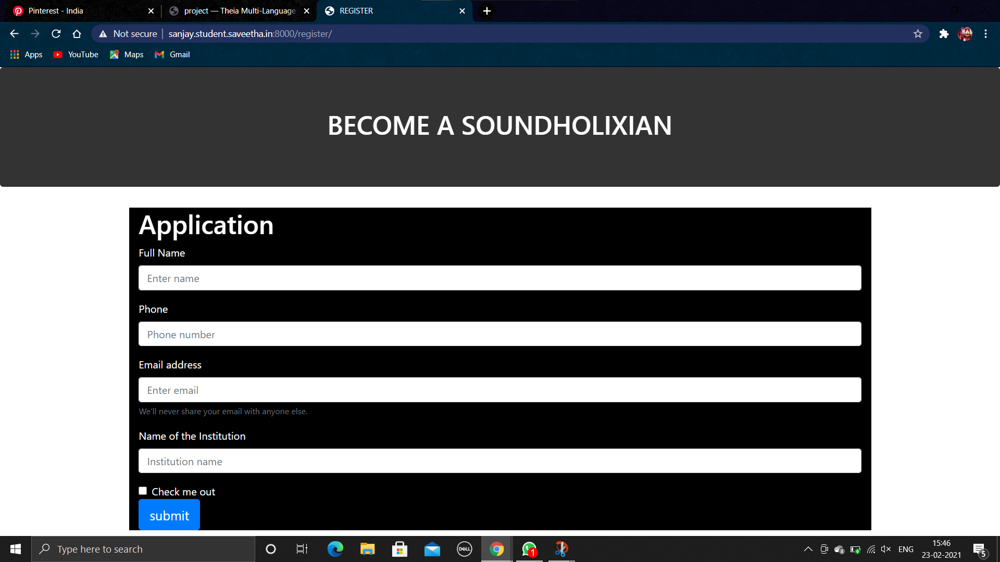
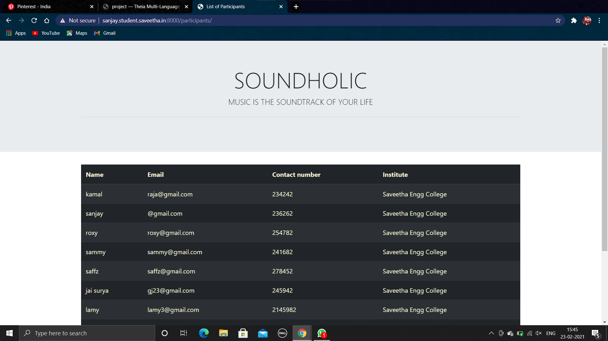
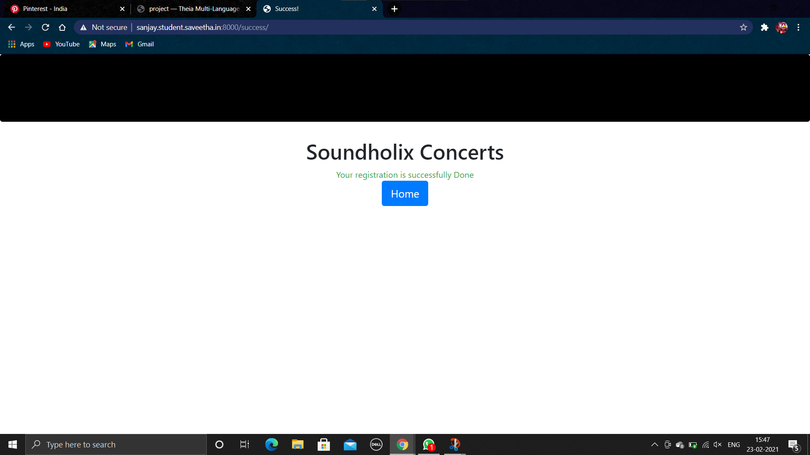
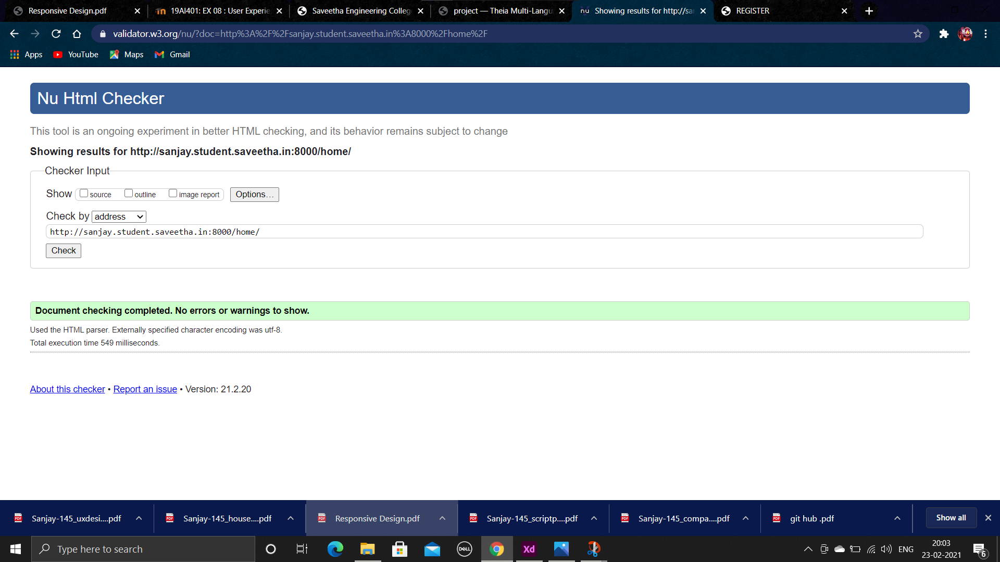

# WebApplication for Event Registration

## AIM:
To create a UX design and develop a web application for event registration.


## DESIGN SCREENS:



## WIREFRAME:


## PROTOTYPE:


## PROGRAM:
### HOME.HTML
```
<!doctype html>
<html lang="en">

<head>
    <!-- Required meta tags -->
    <meta charset="utf-8">
    <meta name="viewport" content="width=device-width, initial-scale=1, shrink-to-fit=no">

    <!-- Bootstrap CSS -->
    <link rel="stylesheet" href="https://maxcdn.bootstrapcdn.com/bootstrap/4.0.0/css/bootstrap.min.css"
        integrity="sha384-Gn5384xqQ1aoWXA+058RXPxPg6fy4IWvTNh0E263XmFcJlSAwiGgFAW/dAiS6JXm" crossorigin="anonymous">

    <title>Home</title>
    
    <style>
        .color{
            background-color: #0e0c0c;
            color: white;
        }
        #photo{
            width: 100%;
            height: 450px;
            text-align:center;
            background-image: url("https://images.pexels.com/photos/1190297/pexels-photo-1190297.jpeg?auto=compress&cs=tinysrgb&dpr=1&w=500");
        }    
        #reg{
            text-align: center;
  
        }
    </style>
</head>

<body>
    <div class="jumbotron jumbotron-fluid color" >
        <div class="container text-center ">
             <h1 class="display-4">SOUNDHOLIX</h1>
            <p class="lead">MUSIC IS SOUNDTRACK OF YOUR LIFE</p>
            <hr class="my-4">
        </div>
    </div>
    <div id="photo" >
    <div class="container text-center">
        <div class='row '>
        </div>
        <a href="/register/" class="btn btn-primary btn-lg" role="button" id="reg">Register</a>
        
    </div>
</div>
    <script src="https://code.jquery.com/jquery-3.2.1.slim.min.js"
        integrity="sha384-KJ3o2DKtIkvYIK3UENzmM7KCkRr/rE9/Qpg6aAZGJwFDMVNA/GpGFF93hXpG5KkN"
        crossorigin="anonymous"></script>
    <script src="https://cdnjs.cloudflare.com/ajax/libs/popper.js/1.12.9/umd/popper.min.js"
        integrity="sha384-ApNbgh9B+Y1QKtv3Rn7W3mgPxhU9K/ScQsAP7hUibX39j7fakFPskvXusvfa0b4Q"
        crossorigin="anonymous"></script>
    <script src="https://maxcdn.bootstrapcdn.com/bootstrap/4.0.0/js/bootstrap.min.js"
        integrity="sha384-JZR6Spejh4U02d8jOt6vLEHfe/JQGiRRSQQxSfFWpi1MquVdAyjUar5+76PVCmYl"
        crossorigin="anonymous"></script>
</body>

</html>
```
### REGISTRATION.HTML:
```
<!doctype html>
<html lang="en">

<head>
    <!-- Required meta tags -->
    <meta charset="utf-8">
    <meta name="viewport" content="width=device-width, initial-scale=1, shrink-to-fit=no">

    <!-- Bootstrap CSS -->
    <link rel="stylesheet" href="https://maxcdn.bootstrapcdn.com/bootstrap/4.0.0/css/bootstrap.min.css"
        integrity="sha384-Gn5384xqQ1aoWXA+058RXPxPg6fy4IWvTNh0E263XmFcJlSAwiGgFAW/dAiS6JXm" crossorigin="anonymous">

    <title>REGISTER</title>
</head>

<body>
    <div class="jumbotron" style = "background: #333;">
        <div class="cotainer text-center text-white">
            <h1>BECOME A SOUNDHOLIXIAN</h1>
        </div>
    </div>
    <div class="container text-white" style = "background: rgb(0, 0, 0);">
        <div class="row">
            <div class="col-12 text-center">
                
            </div>
        </div>
        <div class="row">
            <div class="col-12">
                <h1>Application</h1>
                <form>
                    <div class="form-group">
                        <label for="exampleInputEmail1">Full Name</label>
                        <input type="name" class="form-control" 
                            placeholder="Enter name">
                        
                    </div>
                    <div class="form-group">
                        <label for="exampleInputEmail1">Phone</label>
                        <input type="name" class="form-control" 
                            placeholder="Phone number">
                        
                    </div>
                    
                    <div class="form-group">
                        <label for="exampleInputEmail1">Email address</label>
                        <input type="email" class="form-control" id="exampleInputEmail1" aria-describedby="emailHelp"
                            placeholder="Enter email">
                        <small id="emailHelp" class="form-text text-muted">We'll never share your email with anyone
                            else.</small>
                    </div>
                    <div class="form-group">
                        <label for="exampleInputEmail1">Name of the Institution</label>
                        <input type="name" class="form-control" 
                            placeholder="Institution name">
                    </div>
                    <div class="form-check">
                        <input type="checkbox" class="form-check-input" id="exampleCheck1">
                        <label class="form-check-label" for="exampleCheck1">Check me out</label>
                    </div>
                     <a href="/success/" class="btn btn-primary btn-lg" role="button" id="reg">submit</a>
                </form>
            </div>
        </div>
    </div>

    <!-- Optional JavaScript -->
    <!-- jQuery first, then Popper.js, then Bootstrap JS -->
    <script src="https://code.jquery.com/jquery-3.2.1.slim.min.js"
        integrity="sha384-KJ3o2DKtIkvYIK3UENzmM7KCkRr/rE9/Qpg6aAZGJwFDMVNA/GpGFF93hXpG5KkN"
        crossorigin="anonymous"></script>
    <script src="https://cdnjs.cloudflare.com/ajax/libs/popper.js/1.12.9/umd/popper.min.js"
        integrity="sha384-ApNbgh9B+Y1QKtv3Rn7W3mgPxhU9K/ScQsAP7hUibX39j7fakFPskvXusvfa0b4Q"
        crossorigin="anonymous"></script>
    <script src="https://maxcdn.bootstrapcdn.com/bootstrap/4.0.0/js/bootstrap.min.js"
        integrity="sha384-JZR6Spejh4U02d8jOt6vLEHfe/JQGiRRSQQxSfFWpi1MquVdAyjUar5+76PVCmYl"
        crossorigin="anonymous"></script>
</body>

</html>
```
### SUCCESS.HTML:
```
<!doctype html>
<html lang="en">

<head>
    <!-- Required meta tags -->
    <meta charset="utf-8">
    <meta name="viewport" content="width=device-width, initial-scale=1, shrink-to-fit=no">

    <!-- Bootstrap CSS -->
    <link rel="stylesheet" href="https://maxcdn.bootstrapcdn.com/bootstrap/4.0.0/css/bootstrap.min.css"
        integrity="sha384-Gn5384xqQ1aoWXA+058RXPxPg6fy4IWvTNh0E263XmFcJlSAwiGgFAW/dAiS6JXm" crossorigin="anonymous">

    <title>Success!</title>
</head>

<body>
    <div class="jumbotron" style="background-color: rgb(0, 0, 0);"  >
        
    </div>
    <div class="container" >
        <div class="row">
            <div class="col-12 text-center">
                <h1>Soundholix Concerts</h1>
            </div>
        </div>
        <div class="row">
            <div class="col-12 text-center text-success">
                Your registration is successfully Done
            </div>
        </div>
        <div class="row">
            <div class="col-12 text-center">
                <a href="/home/" class="btn btn-primary btn-lg" role="button">Home</a>
            </div>
        </div>
    </div>

    <!-- Optional JavaScript -->
    <!-- jQuery first, then Popper.js, then Bootstrap JS -->
    <script src="https://code.jquery.com/jquery-3.2.1.slim.min.js"
        integrity="sha384-KJ3o2DKtIkvYIK3UENzmM7KCkRr/rE9/Qpg6aAZGJwFDMVNA/GpGFF93hXpG5KkN"
        crossorigin="anonymous"></script>
    <script src="https://cdnjs.cloudflare.com/ajax/libs/popper.js/1.12.9/umd/popper.min.js"
        integrity="sha384-ApNbgh9B+Y1QKtv3Rn7W3mgPxhU9K/ScQsAP7hUibX39j7fakFPskvXusvfa0b4Q"
        crossorigin="anonymous"></script>
    <script src="https://maxcdn.bootstrapcdn.com/bootstrap/4.0.0/js/bootstrap.min.js"
        integrity="sha384-JZR6Spejh4U02d8jOt6vLEHfe/JQGiRRSQQxSfFWpi1MquVdAyjUar5+76PVCmYl"
        crossorigin="anonymous"></script>
</body>

</html>

```
### ERROR.HTML:
```
<!doctype html>
<html lang="en">

<head>
    <!-- Required meta tags -->
    <meta charset="utf-8">
    <meta name="viewport" content="width=device-width, initial-scale=1, shrink-to-fit=no">

    <!-- Bootstrap CSS -->
    <link rel="stylesheet" href="https://maxcdn.bootstrapcdn.com/bootstrap/4.0.0/css/bootstrap.min.css"
        integrity="sha384-Gn5384xqQ1aoWXA+058RXPxPg6fy4IWvTNh0E263XmFcJlSAwiGgFAW/dAiS6JXm" crossorigin="anonymous">

    <title>Hello, world!</title>
</head>

<body>
    <div class="jumbotron">
        
    </div>
    <div class="container">
        <div class="row">
            <div class="col-12 text-center">
                <h1>We,re sorry :(</h1>
            </div>
        </div>
        <div class="row">
            <div class="col-12 text-center text-danger">
                All the seats are full.
            </div>
        </div>
        <div class="row">
            <div class="col-12 text-center">
                <a href="/home/" class="btn btn-primary btn-lg" role="button">Home</a>
            </div>
        </div>
    </div>

    <!-- Optional JavaScript -->
    <!-- jQuery first, then Popper.js, then Bootstrap JS -->
    <script src="https://code.jquery.com/jquery-3.2.1.slim.min.js"
        integrity="sha384-KJ3o2DKtIkvYIK3UENzmM7KCkRr/rE9/Qpg6aAZGJwFDMVNA/GpGFF93hXpG5KkN"
        crossorigin="anonymous"></script>
    <script src="https://cdnjs.cloudflare.com/ajax/libs/popper.js/1.12.9/umd/popper.min.js"
        integrity="sha384-ApNbgh9B+Y1QKtv3Rn7W3mgPxhU9K/ScQsAP7hUibX39j7fakFPskvXusvfa0b4Q"
        crossorigin="anonymous"></script>
    <script src="https://maxcdn.bootstrapcdn.com/bootstrap/4.0.0/js/bootstrap.min.js"
        integrity="sha384-JZR6Spejh4U02d8jOt6vLEHfe/JQGiRRSQQxSfFWpi1MquVdAyjUar5+76PVCmYl"
        crossorigin="anonymous"></script>
</body>

</html>

```
### LISTOFPARTICIPANTS.HTML:
```
<!doctype html>
<html lang="en">

<head>
    <!-- Required meta tags -->
    <meta charset="utf-8">
    <meta name="viewport" content="width=device-width, initial-scale=1, shrink-to-fit=no">

    <!-- Bootstrap CSS -->
    <link rel="stylesheet" href="https://maxcdn.bootstrapcdn.com/bootstrap/4.0.0/css/bootstrap.min.css"
        integrity="sha384-Gn5384xqQ1aoWXA+058RXPxPg6fy4IWvTNh0E263XmFcJlSAwiGgFAW/dAiS6JXm" crossorigin="anonymous">

    <title>List of Participants</title>
</head>

<body>
    <div class="jumbotron jumbotron-fluid">
        <div class="container text-center">
            <h1 class="display-4">SOUNDHOLIC</h1>
            <p class="lead">MUSIC IS THE SOUNDTRACK OF YOUR LIFE</p>
            <hr class="my-4">
        </div>
    </div>
    <div class="container" style=color:beige>
        <table class="table  table-striped table-dark" style=color:beige>
            <thead>
                <tr>
                    <th scope="col">Name</th>
                    <th scope="col">Email</th>
                    <th scope="col">Contact number</th>
                    <th scope="col">Institute</th>

                </tr>
            </thead>
            <tbody>
                <tr>
                    <td>kamal</td>
                    <td>raja@gmail.com</td>
                    <td>234242</td>
                    <td>Saveetha Engg College</td>
                </tr>
                <tr>
                    <td>sanjay</td>
                    <td>@gmail.com</td>
                    <td>236262</td>
                    <td>Saveetha Engg College</td>
                </tr>
                <tr>
                    <td>roxy</td>
                    <td>roxy@gmail.com</td>
                    <td>254782</td>
                    <td>Saveetha Engg College</td>
                </tr>
                <tr>
                    <td>sammy</td>
                    <td>sammy@gmail.com</td>
                    <td>241682</td>
                    <td>Saveetha Engg College</td>
                </tr>
                <tr>
                    <td>saffz</td>
                    <td>saffz@gmail.com</td>
                    <td>278452</td>
                    <td>Saveetha Engg College</td>
                </tr>
                <tr>
                    <td>jai surya</td>
                    <td>gj23@gmail.com</td>
                    <td>245942</td>
                    <td>Saveetha Engg College</td>
                </tr>
                <tr>
                    <td>lamy</td>
                    <td>lamy3@gmail.com</td>
                    <td>2145982</td>
                    <td>Saveetha Engg College</td>
                </tr>
                <tr>
                    <td>danny</td>
                    <td>danns@gmail.com</td>
                    <td>2344562</td>
                    <td>Saveetha Engg College</td>
                </tr>
                <tr>
                    <td>soni</td>
                    <td>sonish@gmail.com</td>
                    <td>2344789</td>
                    <td>Saveetha Engg College</td>
                </tr>
                <tr>
                    <td>vincent</td>
                    <td>vincent@gmail.com</td>
                    <td>234242</td>
                    <td>Saveetha Engg College</td>
                </tr>
                <tr>
                    <td>swetha</td>
                    <td>sweths@gmail.com</td>
                    <td>234245</td>
                    <td>Saveetha Engg College</td>
                </tr>
                <tr>
                    <td>peppy</td>
                    <td>peps@gmail.com</td>
                    <td>234242</td>
                    <td>Saveetha Engg College</td>
                </tr>


            </tbody>
        </table>
    </div>

    <!-- Optional JavaScript -->
    <!-- jQuery first, then Popper.js, then Bootstrap JS -->
    <script src="https://code.jquery.com/jquery-3.2.1.slim.min.js"
        integrity="sha384-KJ3o2DKtIkvYIK3UENzmM7KCkRr/rE9/Qpg6aAZGJwFDMVNA/GpGFF93hXpG5KkN"
        crossorigin="anonymous"></script>
    <script src="https://cdnjs.cloudflare.com/ajax/libs/popper.js/1.12.9/umd/popper.min.js"
        integrity="sha384-ApNbgh9B+Y1QKtv3Rn7W3mgPxhU9K/ScQsAP7hUibX39j7fakFPskvXusvfa0b4Q"
        crossorigin="anonymous"></script>
    <script src="https://maxcdn.bootstrapcdn.com/bootstrap/4.0.0/js/bootstrap.min.js"
        integrity="sha384-JZR6Spejh4U02d8jOt6vLEHfe/JQGiRRSQQxSfFWpi1MquVdAyjUar5+76PVCmYl"
        crossorigin="anonymous"></script>
</body>

</html>
```

## OUTPUT:






## VALIDATION REPORT:


## RESULT:
Thus an UX design and a web application has been devloped for event registration. It is hosted in the URL http://sanjay.student.saveetha.in:8000/home/ . HTML code is validated.